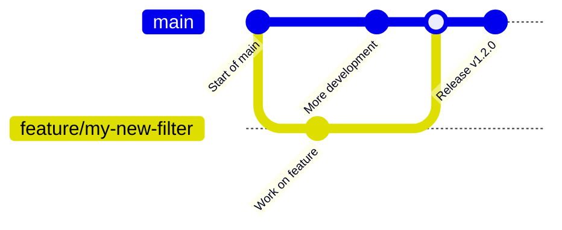
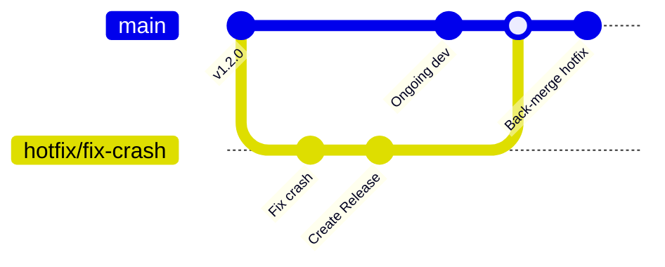

# Contributing to OpenFilter

Thank you for your interest in contributing to **OpenFilter**! 🎉
Whether you're fixing a bug, improving documentation, or designing a new filter — your input is welcome and deeply appreciated.

This guide will walk you through:

* Setting up your development environment
* Understanding how contributions are reviewed and accepted
* OpenFilter’s coding conventions
* Signing your commits (we use the Developer Certificate of Origin, or DCO)
* How to become a maintainer (if you're into that kind of thing)

Before diving in, please take a moment to review our [community guidelines](#openfilter-community-guidelines) to make sure we keep this a respectful and inclusive space for everyone.

## Topics

* [Contributing to OpenFilter](#contributing-to-openfilter)

  * [Topics](#topics)
  * [Setting up your development environment](#setting-up-your-development-environment)
  * [Reporting issues](#reporting-issues)
  * [Quick contribution tips and guidelines](#quick-contribution-tips-and-guidelines)

    * [Pull requests are always welcome](#pull-requests-are-always-welcome)
    * [Conventions](#conventions)
    * [Merge approval](#merge-approval)
    * [Sign your work (DCO)](#sign-your-work-dco)
    * [Becoming a maintainer](#becoming-a-maintainer)
  * [OpenFilter community guidelines](#openfilter-community-guidelines)
  * [Coding Style](#coding-style)
  * [Contributor Roadmap](#contributor-roadmap)
  * [Release Process](#release-process)
  * [Thank you](#thank-you-)

## Setting up your development environment

You can contribute to OpenFilter without any container tools or build systems — just plain Python.

### 1. Clone the repo

```bash
git clone git@github.com:PlainsightAI/openfilter.git
cd openfilter
```

### 2. Install the library (editable mode)

```bash
pip install -e .[all]
```

This installs the OpenFilter package along with all builtin utility filter dependencies. If you're only working with a subset of filters, you may omit `[all]`.

### 3. Run filters locally

Use either a Python script or the CLI to connect filters together. For example, to play a video through Webvis:

```bash
openfilter run \
  - VideoIn --sources file://PATH_TO_VIDEO.mp4 \
  - Webvis --sources tcp://localhost
```

You can also build your own filter class in a script and run it using `Filter.run_multi([...])`. See the [Examples](https://github.com/PlainsightAI/openfilter#examples)

## Reporting issues

Found a bug? Got a suggestion? Think something might be a security concern? Awesome — we’d love to hear about it.

When reporting an issue, please include:

* A clear, descriptive title
* What you expected to happen
* What actually happened
* Steps to reproduce it (if possible)
* Logs, stack traces, or screenshots (feel free to redact sensitive data)

To keep things efficient:

* First, [search existing issues](https://github.com/PlainsightAI/openfilter/issues) to see if it's already known.
* If it’s a potential security issue, please be discreet: **do not post sensitive details publicly**. Instead, open an issue with minimal info and tag it appropriately, or reach out to the maintainers privately if listed.

If you're not sure whether something is a bug or a feature request — go ahead and file it anyway. We'll help triage it.

## Quick contribution tips and guidelines

These are general practices to make the contribution process smoother for everyone.

### Pull requests are always welcome

Whether it’s fixing a typo, clarifying a comment, or building a new filter — PRs of all sizes are welcome. For larger contributions (e.g., new features or filters), consider opening an issue or discussion first to align on the approach.

If you're unsure whether a change is "big enough" to be worth a PR — it probably is. We prefer iterative progress.

### Conventions

* Make your changes in a feature branch.
* Use clear branch naming. For example:
  * Bugfix: `1234-fix-filter-shutdown`
  * Feature: `4567-add-fancy-thing`
* All contributions should be made against the `main` branch.
* **Do not submit pull requests directly to `release`** — that branch is managed by core maintainers and reflects the latest stable version of OpenFilter.
* When a release is ready, core maintainers will merge changes from `main` into `release`.
* Include unit tests when appropriate. Run `make test-all` or `pytest` to verify.
* Keep pull requests focused — unrelated changes should go in separate PRs.
* Run linters and formatting before pushing (`black`, `ruff`, etc. where applicable).
* When possible, include documentation updates in the same PR.
* Reference issues using `Closes #123` or `Fixes #123` in your PR description so they auto-close on merge.


### Commit message formatting

Follow the conventional format:

```
Short summary (max 50 chars)

Optional detailed explanation. Include rationale, context,
and anything else that helps reviewers understand the change.
```

Keep commits clean and meaningful — use `git rebase -i` to squash when needed.

### Merge approval

Pull requests need at least one approval from a maintainer. For core components or architectural changes, two approvals may be requested.

We use `LGTM` ("Looks Good To Me") in review comments to indicate approval.

If your PR has stalled, feel free to ping the reviewers via GitHub comments.

### Sign your work (DCO)

All contributions must be signed using the **Developer Certificate of Origin (DCO)**. This is a lightweight way to certify authorship and licensing compliance.

You must sign your contributions by adding a line like this to each commit message:

```
Signed-off-by: Your Name <your.email@example.com>
```

You can do this automatically with the `-s` flag:

```bash
git commit -s -m "Fix issue with frame parsing"
```

Use your real name — no pseudonyms or anonymous sign-offs, please.

By signing your contributions, you certify the following:

```
Developer Certificate of Origin
Version 1.1

Copyright (C) 2004, 2006 The Linux Foundation and its contributors.

Everyone is permitted to copy and distribute verbatim copies of this
license document, but changing it is not allowed.


Developer's Certificate of Origin 1.1

By making a contribution to this project, I certify that:

(a) The contribution was created in whole or in part by me and I
    have the right to submit it under the open source license
    indicated in the file; or

(b) The contribution is based upon previous work that, to the best
    of my knowledge, is covered under an appropriate open source
    license and I have the right under that license to submit that
    work with modifications, whether created in whole or in part
    by me, under the same open source license (unless I am
    permitted to submit under a different license), as indicated
    in the file; or

(c) The contribution was provided directly to me by some other
    person who certified (a), (b) or (c) and I have not modified
    it.

(d) I understand and agree that this project and the contribution
    are public and that a record of the contribution (including all
    personal information I submit with it, including my sign-off) is
    maintained indefinitely and may be redistributed consistent with
    this project or the open source license(s) involved.
```
(Source: [developercertificate.org](https://developercertificate.org/))

### Becoming a maintainer

Regular contributors who demonstrate ownership, care, and technical proficiency may be invited to become maintainers.

Maintainers are expected to:

* Review PRs
* Triage issues
* Guide design discussions
* Uphold code and community standards

If you're interested in becoming a maintainer, let us know in a PR or discussion — we’re happy to grow the team!

## OpenFilter community guidelines

We want OpenFilter to be a welcoming, respectful, and productive space for contributors of all backgrounds and experience levels.

A few things we ask of everyone:

* Be respectful — to people, their time, and their code.
* Keep discussions focused and constructive.
* Avoid off-topic noise and personal messaging (use GitHub mentions if you need attention).
* Don't share anything sensitive or illegal.
* Encourage participation — even if someone’s just starting out.

Help us keep the quality of conversation high. This is an engineering project, but also a human one.

## Coding Style

OpenFilter is Python-first, and we aim for readability, consistency, and ease of maintenance.

### General guidelines:

* Use `black` for formatting. It’s the default style for this project.
* Keep your code `ruff`-clean. We lint all PRs with it.
* Write clear and purposeful code — even if it's short, leave a comment when the intent isn’t obvious.
* Prefer composition and clarity over cleverness.
* Avoid unnecessary abstractions unless they serve real reuse.

### Docstrings & comments

* Document public functions and classes with a brief summary.
* Internal methods should have at least one-line docstrings or inline comments explaining why (not just how).
* If it’s a workaround or a hack, document the reason and link the issue if one exists.

### Type hints

Use type hints wherever helpful, especially for:

* Function arguments and return types
* Public APIs
* Complex data structures (`dict[str, Frame]`, etc.)

You don’t have to annotate everything — just the parts where it improves clarity.

## Contributor Roadmap

We maintain an open contributor roadmap to highlight high-impact areas where your help is most welcome. These are often features under active discussion or work-in-progress that would benefit from outside contributions.

Whether you're just getting started or looking for more advanced challenges, there's something here for everyone.

### 🧰 Beginner to Intermediate

These tasks are ideal for contributors familiarizing themselves with OpenFilter's codebase and conventions.

- **Scaffolding CLI**
  - Add a new `openfilter new <project-name>` command that generates boilerplate code and directory structure for a new filter (e.g. with a config class, unit tests, and a README).
  - Could optionally allow templates or presets (e.g. image/video filters).

- **Fix flakey tests**
  - Address unstable tests like `outputs_balance_doubly_ephemeral_watch`, which intermittently fail in CI.
  - Identify root causes, improve determinism, or isolate timing-sensitive logic.

### 🎥 Pipeline & IO Integrations

Work on expanding OpenFilter's ability to connect with external systems and sources.

- **Multi-camera support**
  - Build or extend filters that handle **multiple input streams** simultaneously.
  - Could involve aligning timestamps, batching frames, or producing combined events.

- **Connectors**
  - Implement filters that integrate OpenFilter with external systems for input/output, logging, or data persistence.
  - Each connector should support streaming and batched modes, reconnections, and structured payloads.

  **Suggested connectors:**

  - Kafka – Ingest or emit messages from/to Apache Kafka topics
  - Redis – Use Redis Pub/Sub or Streams for real-time data movement
  - Amazon SQS – Ingest tasks or emit events using SQS queues
  - Amazon SNS – Publish messages to SNS topics for fan-out delivery
  - Google Pub/Sub – Support GCP’s pub/sub model
  - MQTT – Ingest telemetry or broadcast events using lightweight messaging
  - PostgreSQL – Log structured records to relational databases
  - Google Cloud Storage (GCS) – Ingest/export video or data from buckets
  - Amazon S3 – Similar to GCS, for AWS users

### 🤖 Models & Artifacts

Extend model and artifact handling beyond current limitations.

- **Hugging Face models**
  - Enable downloading and loading models from the Hugging Face Hub (e.g. `bert-base-uncased`) within a filter.
  - Should support offline cache behavior and dynamic model selection via config.

- **DLCache enhancements**
  - Add support for additional protocols such as:
    - `gcs://` (Google Cloud Storage)
    - `gar://` (Google Artifact Registry)
    - `s3://` (Amazon S3)
      - The `s3://` us currently implemented in VideoIn outside of DLCache
  - Ensure models, videos, and other assets can be cached and reused without re-downloading on every run.

### 📈 Observability

Improve how OpenFilter exposes its behavior and performance.

- **Instrumentation**
  - Add internal timing metrics, memory usage tracking, and operation counters to key filter functions.
  - Instrumentation should be toggleable and avoid adding runtime overhead when disabled.

- **Telemetry delivery**
  - Implement delivery of metrics or logs to external systems (e.g. Prometheus, GCP Monitoring, DataDog).
  - Should support periodic flushing, batching, and fallback mechanisms if the target is unavailable.

---

🔁 **Want to work on one of these?**
Open an issue or comment on an existing one to signal your interest. If you’re unsure where to start, we’re happy to help guide you through your first steps.

---

## Release Process

OpenFilter uses a structured release workflow to ensure stability, transparency, and traceability of code changes.

Whether you're contributing a quick fix or a large feature, it's important to understand how changes move from your local branch into production.

### 🧵 Development Flow

- All contributors (including maintainers) **branch off of `main`** for any feature, bugfix, or documentation update.
- Pull requests should always **target `main`**, which serves as the active development branch.
- Once PRs are approved and merged into `main`, they are queued for inclusion in the next release.

> 🔒 **Important:** Only **core maintainers** are allowed to merge code into `main`. This ensures all published versions are stable, reviewed, and correctly documented.

### 🛠️ Releasing

- Releases are **cut from the `main` branch**, which always reflects the **latest development version** of OpenFilter.
- To create a release from `main`, the following must be true:
  - The `RELEASE.md` file contains an accurate and up-to-date changelog entry for the version.
  - The `VERSION` file matches the version declared in `RELEASE.md`.

> This guards against accidental or incomplete releases and ensures that the changelog is always reliable.

Once merged, the release automation tags the version, pushes a GitHub release, publishes documentation, and optionally builds artifacts (e.g., Docker images, Python wheels).

The final step in the CI pipeline requires manual review and approval by a core maintainer. Upon approval, the package version is automaticlaly published to PyPi.

### 🧯 Hotfixes

We aspire to keep the main branch in a valid and ready-for-release condition at all times. Under ideal conditions, hotfixes should be included in the `main` branch and an expedited release should be triggered.
Under less than ideal conditions, an urgent fix may need to be deployed without including additional code changes from main.

- In these cases, hotfix branches are **branched from the latest tagged release commit**, not `main`.
- Once the fix is ready, it's:
  1. Published to all avenues as a one-off release
  2. Then merged **forward into `main`** to ensure future releases retain the hotfix.

This guarantees the stability of released versions as much as possible.

---

### 🔄 Diagram: Standard Release Flow



### 🚑 Diagram: Hotfix Flow



---

### ✅ TL;DR

| Action                          | From               | To                | Who                                       |
| ------------------------------- | ------------------ | ----------------- | ----------------------------------------- |
| New features & fixes            | `main`             | `main`            | Anyone (via PR)                           |
| Release preparation             | `main`             | `main` (tagged)   | Core maintainers only                     |
| Hotfixes                        | Latest release tag | `main` (after PR) | Anyone (via PR), core maintainers approve |
| Back-port hotfix to development | Hotfix branch      | `main`            | Core maintainers                          |

## Thank you 🙏

Whether you're fixing typos or building entirely new filters, your contribution matters.
OpenFilter is better because of people like you.

If you have questions, suggestions, or just want to say hi — feel free to open an issue or start a discussion on GitHub.

---

*This project is maintained under the Apache 2.0 License.*
