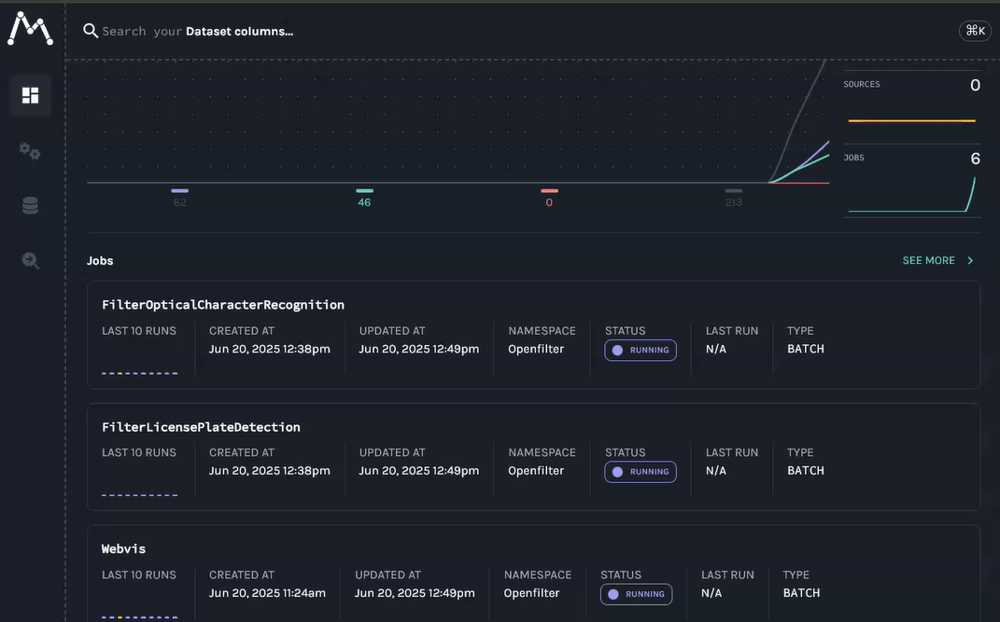
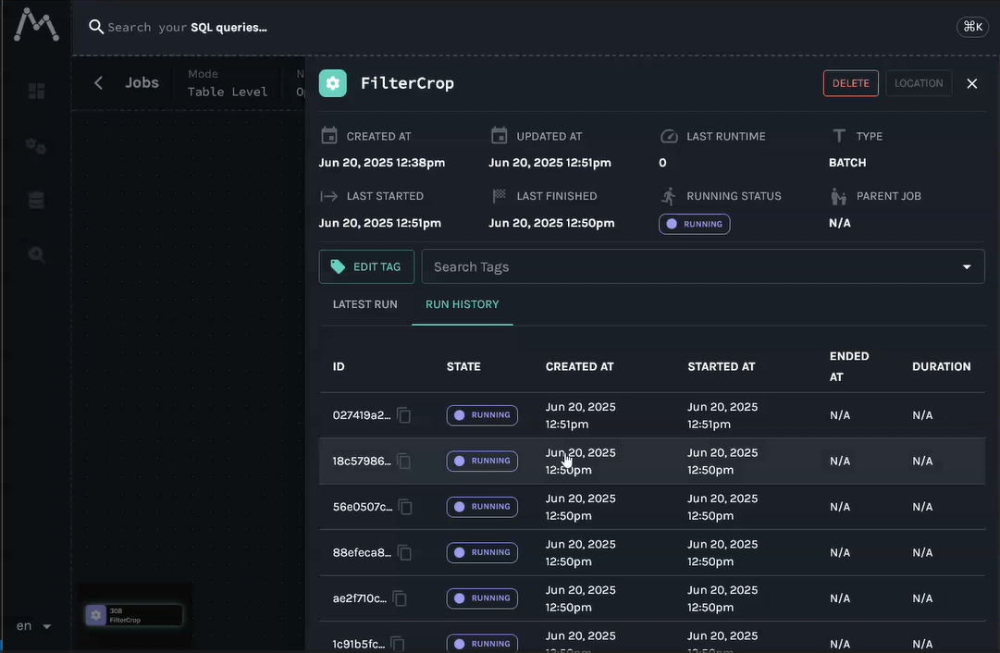

# Overview

For installation, go directly to [Installation](#installation). Examples, [Examples](#examples).

More in depth guides can be found here:
* [Your First Filter](./your-first-filter.md)

This is a framework for `Filter` components which compose an image processing pipeline. It mostly takes care of setup, serialization and communication between the components and various outher quality-of-life things. There are also some basic utility components included for stuff like reading and writing video, REST endpoint input, MQTT output, visualisation and more.

A user filter component will subclass off of the `Filter` class provided here and is meant to be built and run as an indivisual unit in a pipeline. There are functions to run a user Filter component alongside other Filters in their own processes in order to rapidly test and iterate.

Filters are chained together in a pipeline and can have up to many-to-many topologies, as long as there are no cycles. Synchronization is taken care of automatically so that all input frames that come in together stay together until the output. Unsynchronized filter paths can also be specified to allow a slower processing path to be triggerred without slowing down the rest of the pipeline. Load balancing is also supported so that an expensive workload can be broken up to run on multiple copies of a Filter (or even pipeline) in parallel and the sequence rejoined on output to achieve a higher framerate than would be possible with a single Filter.

For more misc tidbits of knowledge see the [Other stuff](#other_stuff) section at the end.

## Filter

The `Filter` class is the base class for all filters. A filter is just a component which may originate, process or export a stream of images and/or data, usually images. Your own filter component will derive from `Filter` and overload a few functions in order to do its thing. There are a few functions which can be overloaded, but three main functions you will normally work with and only one of them is absolutely necessary - `process()`. The basic template is as follows:

    from openfilter.filter_runtime import FilterConfig, Filter

    class MyFilterConfig(FilterConfig):
        my_option: str
        ...

    class MyFilter(Filter):
        @classmethod
        def normalize_config(cls, config):
            ...
            config = MyFilterConfig(super().normalize_config(config))
            ...
            return config

        def setup(self, config):
            ...

        def process(self, frames):
            ...
            return frames


The config class (in this case `MyFilterConfig`) is at base just a dictionary of key/value pairs which can be accessed as attributes for convenience. It is parsed for you from environment variables or command line arguments or passed in from another function executing your filter.

The `normalize_config()` function is called on filter instantiation to validate and normalize a config object. It is the job of this function to put the config into a state you will use and make sure the options make sense. The function should only check for correctness, not presence or absence of outside resources like files or network connections.

That is the job of the `setup()` function. This function will be called with the same `config` object that was returned from your `normalize_config()`. It will be the very same object so if you want to add hidden config options in that function, the pattern for that is to name those options starting with an underscore '_', and they will not be logged when the config object is logged but you will get them in `setup()`. You should treat the config object as a function parameter and copy it or parts of it to your own local class attributes in `setup()`.

Finally, the `process()` function will be called on each frame or multiple frames received from one or more upstream connected `Filter` components. The incoming parameter `frames` is a dictionary of zero or more string topic name indexed `Frame` objects. A `Frame` object encapsulates exactly one or zero images and a data dictionary associated with the image. You do your processing needed in this function and return `None`, a single `Frame` object or a dictionary of string topic names indexing `Frame` objects. If `None` is returned then nothing is passed downstream, otherwise whatever you return (including an empty dictionary) will become the input for downstream `Filter` components.

Other functions you may find useful to overload is `shutdown()`, this is called on exit (clean or exception) and lets you clean up after yourself.

## Frame

A `Frame` object encapsulates an image possibly or `None` and a (possibly empty) dictionary of key/value pairs associated with that image. It is perfectly fine to pass data without passing an image, but if there is data to be passed which relates to an image then it should be passed in the dictionary of the `Frame` containing that image.

When dealing with `Frame` objects there is no preset format (RGB, BGR or GRAY). The `Frame` itself knows what format the image is in and when you wish to use the image you request it in the format you want: `frame.rgb`, `frame.bgr` or `frame.gray`. These properties are smart and if the image in the frame is already in the requested format then they do nothing and just return the current `Frame`. Likewise, when creating a `Frame` object for passing downstream you should specify the format you are sending to avoid ambiguity, either by specifying it directly as in `Frame(image, data, 'BGR')` or by using the incoming frame as a template to copy data and format information `Frame(new_image, old_frame)`.

A `Frame` will also normally come from upstream with a readonly image. For technical reasons this is more optimal than always creating a writable image when all you will need to do is read the image (like for inference). JPG encoding is normally also used for passing the images between component and if a readonly frame does not have its image modified and passes the image downstream in the proper way then relatively expensive reencoding of the JPG image does not have to take place again as it will be passed through cached in the `Frame` object, even if you create a new frame from the incoming one, e.g. `Frame(old_frame, new_data)`.

If you need a writable image because you will be modifying it or passing it to something which needs a writable image then you need to conver the frame first. This is done in a manner similar to format conversion, `frame.rw` will give you a new `Frame` with a writable copy of the incoming image. If the `frame` object was already writable then nothing happens and you get back the same `frame`. A new writable `Frame` object will not preserve any JPG encoding that came in from the network though as it is writable and any changes which will be done to the image would invalidate the encoding anyway.

If you need an image from an incoming frame in a specific format / writable state you should always assume the incoming frame is in an unknown state and access it in the way you will want the image. `frame.rw_rgb`, `frame.rw_bgr`, `frame.ro_rgb` and `frame.ro_bgr` will give you the a `Frame` object with the kind of image you want in the most optimal manner from what the `Frame` currently is, including returning the same exact `Frame` object if it is already in the desired format. Likewise, if possible, it will preserve any JPG encoding to pass on downstream.

<a id="installation"></a>
# Installation

## Quick install with ALL dependencies

These installation instructions will install all the dependencies used by all builtin utility filters. If you wish to install without those dependencies then simply omit the `[all]`.


### From PyPI

    pip install openfilter[all]

### From Git

    pip install git+ssh://git@github.com/PlainsightAI/openfilter.git@main#egg=openfilter[all]

A specific version:

    pip install git+ssh://git@github.com/PlainsightAI/openfilter.git@v1.3.17#egg=openfilter[all]

If you want to edit the code:

    git clone git@github.com:PlainsightAI/openfilter.git
    cd openfilter
    pip install -e .[all]

<a id="examples"></a>
# Examples

## Show a video

Replace `PATH_TO_YOUR_VIDEO.mp4` with a filename. When this script is running, go to `http://localhost:8000` or `http://localhost:8000/main` to see the video playing, the script will exit when the video ends. Also note that the video input can take the form of `rtsp://path:port/name` or even `webcam://0` for the first webcam, etc...

    from openfilter.filter_runtime.filter import Filter
    from openfilter.filter_runtime.filters.video_in import VideoIn
    from openfilter.filter_runtime.filters.webvis import Webvis

    if __name__ == '__main__':
        Filter.run_multi([
            (VideoIn, dict(sources='file://PATH_TO_YOUR_VIDEO.mp4', outputs='tcp://*')),
            (Webvis,  dict(sources='tcp://localhost')),
        ])

Or running with the CLI:

    openfilter run \
      - VideoIn --sources file://PATH_TO_YOUR_VIDEO.mp4 --outputs 'tcp://*' \
      - Webvis --sources tcp://localhost

The CLI will also autochain filters in simple cases:

    openfilter run - VideoIn --sources file://PATH_TO_YOUR_VIDEO.mp4 - Webvis

From now on the examples will be in script format but understand that they are all runnable using the other methods. Assuming of course you have your filters installed as python modules for the command line approach.

## Example code for quick filter to process a video frame by frame and write out to another video

When this script finishes you can view the output file 'output.mp4'. Note that the `!sync` option on the video source reads the video one frame at a time without skipping anything as fast as possible for processing.

    from openfilter.filter_runtime import Frame, Filter
    from openfilter.filter_runtime.filters.video_in import VideoIn

    class MyFilter(Filter):
        def setup(self, config):  # not needed, just to show usage
            print(f'MyFilter setup: {config.my_happy_little_option=}')

        def process(self, frames):
            frame = frames['main'].rw_rgb  # take the most optimal path to a writable RGB format image from whatever came in
            image = frame.image
            data  = frame.data

            # TODO: process image and data here
            image[:, :, 1] = 0  # zero out the green channel

            return Frame(image, data, 'RGB')  # return frame with new image data, WARNING! if you don't pass the data through the FPS on output videos will be wrong! Specifically the 'meta' object in `.data`, but best practice is to copy the incoming data and add your own data to it.

        def shutdown(self):  # not needed, just to show usage
            print('MyFilter shutting down')

    if __name__ == '__main__':
        Filter.run_multi([
            (VideoIn,  dict(sources='file://PATH_TO_YOUR_VIDEO.mp4!sync', outputs='tcp://*')),  # the '!sync' option reads the video one frame at a time without skipping anything as fast as possible for processing

            (MyFilter, dict(sources='tcp://localhost',                    outputs='tcp://*:5552', my_happy_little_option='YAY')),

            (VideoIn,  dict(sources='tcp://localhost:5552',               outputs='file://output.mp4')),
        ])

## Write every 50th frame from a video to individual jpgs

Note that we don't need to encode the jpg image ourselves but rather use the `Frame.jpg` functionality for it since it is there for compression over then network anyway. The `frame_id` is a monotonically increasing frame number that comes from the `VideoIn` input.

    from openfilter.filter_runtime.filter import Filter
    from openfilter.filter_runtime.filters.video_in import VideoIn

    class WriteFrames(Filter):
        def process(self, frames):
            frame    = frames["main"]
            frame_id = frame.data["meta"]["id"]

            if not frame_id % 50:
                with open(f'frame_{frame_id:04}.jpg', 'wb') as file:
                    file.write(frame.bgr.jpg)  # Frame object encodes jpg but it must come from 'BGR' format to be correct since that is how cv2 processes things, confusing, yes, blame opencv, I do, daily

    if __name__ == '__main__':
        Filter.run_multi([
            (VideoIn,     dict(sources='file://PATH_TO_YOUR_VIDEO.mp4!sync', outputs='tcp://*')),  # '!sync' again because we don't want to wait around all day

            (WriteFrames, dict(sources='tcp://localhost')),
        ])

## Multiple input videos on different topics and simple MQTT

This example demonstrates sending on different topics from reading two videos simultaneously and passing them on to two downstream filters. The `Util` filter will just log what it gets and the `MQTT` filter will output the image as a base64 encoded jpg and the metadata that came with the frame to an mqtt topic. Needless to say you must have an MQTT broker running. You can view the MQTT output with something like [MQTT explorer](https://mqtt-explorer.com/). Note that in the `Util` filter we subscribe to the `main` topic which comes from the first video and a special hidden `_metrics` topic which has some runtime metrics from the `VideoIn` filter. The script will terminate when the first video finishes.

    from openfilter.filter_runtime.filter import Filter
    from openfilter.filter_runtime.filters.mqtt_out import MQTTOut
    from openfilter.filter_runtime.filters.util import Util
    from openfilter.filter_runtime.filters.video_in import VideoIn

    if __name__ == '__main__':
        Filter.run_multi([
            (VideoIn, dict(sources='file://PATH_TO_YOUR_VIDEO.mp4, file://PATH_TO_ANOTHER_VIDEO.mp4;other', outputs='tcp://*')),  # note the ';other' topic specifier

            (Util,    dict(sources='tcp://localhost;main;_metrics', log=True)),  # we only subscribe to one video topic, the ';main' (which is default topic, of the first video)

            (MQTTOut, dict(sources='tcp://localhost;other', outputs='mqtt://localhost:1883/my_mqtt_topic;other')),  # we will receive only the 'other' topic and send it out in its entirety to the broker on the 'my_mqtt_topic' topic
        ])

## Load balancing

This example uses the `Util` filter with delays to simulate long processing times to show how load balancing works. There are three workers that are alternated and note the frame rate at each of those vs. the frame rate at the final output component. Even though each of the three workers sleeps for 3 seconds on every frame, the final output gets 1 frame per second because there are 3 workers. The 'id's are not obligatory, just showing their use.

    from openfilter.filter_runtime.filter import Filter
    from openfilter.filter_runtime.filters.util import Util
    from openfilter.filter_runtime.filters.video_in import VideoIn

    if __name__ == '__main__':
        Filter.run_multi([
            (VideoIn, dict(id='vidin',   sources='file://PATH_TO_YOUR_VIDEO.mp4!sync', outputs='tcp://*')),

            (Util,    dict(id='split',   sources='tcp://localhost', outputs='tcp://*:5552, tcp://*:5554, tcp://*:5556', outputs_balance=True, log=True, sleep=1)),

            (Util,    dict(id='worker1', sources='tcp://localhost:5552', outputs='tcp://*:5562', log=True, sleep=3)),
            (Util,    dict(id='worker2', sources='tcp://localhost:5554', outputs='tcp://*:5564', log=True, sleep=3)),
            (Util,    dict(id='worker3', sources='tcp://localhost:5556', outputs='tcp://*:5566', log=True, sleep=3)),

            (Util,    dict(id='joined',  sources='tcp://localhost:5562, tcp://localhost:5564, tcp://localhost:5566', sources_balance=True, log=True)),
        ])

## Side channel for expensive workloads

This example shows sending off a workload once in a while to a side channel without slowing down the main pipeline. Note that the 'main' topic stays at a stable 1 frame per second regardless of the fact that whenever the 'side' `Util` receives a frame it sleeps for 3 seconds. This is enabled by specifying the source for that channel with a trailing '?' character - `sources='tcp://localhost:5552?`, these are called ephemeral channels because they don't participate in the synchronization of the main stream of frames.

    from random import randint

    from openfilter.filter_runtime.filter import Filter
    from openfilter.filter_runtime.filters.util import Util
    from openfilter.filter_runtime.filters.video_in import VideoIn

    class MyFilter(Filter):
        def process(self, frames):
            if randint(0, 3) == 0:  # once every 4 frames duplicate the frame on another topic
                frame  = frames['main']
                frames = {'main': frame, 'side': frame}

            return frames

    if __name__ == '__main__':
        Filter.run_multi([
            (VideoIn,  dict(sources='file://PATH_TO_YOUR_VIDEO.mp4!sync', outputs='tcp://*')),

            (MyFilter, dict(sources='tcp://localhost', outputs='tcp://*:5552', log=True)),

            (Util,     dict(id='main', sources='tcp://localhost:5552;main', log=True, sleep=1)),
            (Util,     dict(id='side', sources='tcp://localhost:5552?;side', log=True, sleep=3)),
        ])

## Previous load balancing example with dedicated metrics output to MQTT

This introduces doubly-ephemeral channels '??' which are strictly listeners (they don't send requests or participate in flow control at all) and the dedicated metrics output channel. The dedicated metrics channel is the only way to get metrics from an output load balancing component guaranteed not to cause problems with balancing.

    from openfilter.filter_runtime.filter import Filter
    from openfilter.filter_runtime.filters.mqtt_out import MQTTOut
    from openfilter.filter_runtime.filters.util import Util
    from openfilter.filter_runtime.filters.video_in import VideoIn

    if __name__ == '__main__':
        Filter.run_multi([
            (VideoIn, dict(id='vidin',   sources='file://PATH_TO_YOUR_VIDEO.mp4!sync', outputs='tcp://*', outputs_metrics='tcp://*:6550')),

            (Util,    dict(id='split',   sources='tcp://localhost', outputs='tcp://*:5552, tcp://*:5554, tcp://*:5556', outputs_balance=True, log=True, sleep=1, outputs_metrics='tcp://*:6560')),

            (Util,    dict(id='worker1', sources='tcp://localhost:5552', outputs='tcp://*:5562', log=True, sleep=3, outputs_metrics='tcp://*:6552')),
            (Util,    dict(id='worker2', sources='tcp://localhost:5554', outputs='tcp://*:5564', log=True, sleep=3, outputs_metrics='tcp://*:6554')),
            (Util,    dict(id='worker3', sources='tcp://localhost:5556', outputs='tcp://*:5566', log=True, sleep=3, outputs_metrics='tcp://*:6556')),

            (Util,    dict(id='joined',  sources='tcp://localhost:5562, tcp://localhost:5564, tcp://localhost:5566', sources_balance=True, log=True, outputs_metrics='tcp://*:6558')),

            (MQTTOut, dict(
                id      = 'mqttout',
                sources = [
                    'tcp://localhost:6550?? ; _metrics > m_vidin',
                    'tcp://localhost:6560?? ; _metrics > m_split',
                    'tcp://localhost:6552?? ; _metrics > m_worker1',
                    'tcp://localhost:6554?? ; _metrics > m_worker2',
                    'tcp://localhost:6556?? ; _metrics > m_worker3',
                    'tcp://localhost:6558?? ; _metrics > m_joined',
                ],
                outputs  = 'mqtt://localhost:1883/metrics',
                mappings = [
                    'm_vidin/data   > m_vidin',
                    'm_split/data   > m_split',
                    'm_worker1/data > m_worker1',
                    'm_worker2/data > m_worker2',
                    'm_worker3/data > m_worker3',
                    'm_joined/data  > m_joined',
                ],
                interval = 4,  # sample once every four seconds
                qos      = 0,
                retain   = True
            )),
        ])

## Convoluted example just to show a bunch stuff

Webvis video at `http://localhost:8000/yet_another`.

    from openfilter.filter_runtime.filter import Filter
    from openfilter.filter_runtime.filters.mqtt_out import MQTTOut
    from openfilter.filter_runtime.filters.recorder import Recorder
    from openfilter.filter_runtime.filters.util import Util
    from openfilter.filter_runtime.filters.video_in import VideoIn
    from openfilter.filter_runtime.filters.webvis import Webvis

    Filter.run_multi([
        (VideoIn, dict(
            id               = 'video_in',
            sources          = 'file://PATH_TO_YOUR_VIDEO.mp4!no-bgr!resize=640+480, file://PATH_TO_ANOTHER_VIDEO.mp4!maxsize=640x480!sync!loop=3;other, file://YET_ANOTHER_VIDEO.mp4!maxsize=1280x720;yet_another',
            outputs          = 'ipc://video_in_pipe',
        )),
        (Util, dict(
            id               = 'util',
            sources          = 'ipc://video_in_pipe',
            outputs          = 'tcp://*, ipc://util_pipe',
            outputs_required = 'webvis, video_out, mqtt_out',
            log              = True,
        )),
        (Webvis, dict(
            id               = 'webvis',
            sources          = 'tcp://localhost;yet_another',
            host             = '0.0.0.0',
            port             = 8000,
        )),
        (VideoIn, dict(
            id               = 'video_out',
            sources          = 'ipc://util_pipe;other>',
            outputs          = 'file://out_%Y%m%d_%H%M%S.mp4!segtime=1!fps=10!g=30',
        )),
        (MQTTOut, dict(
            id               = 'mqtt_out',
            sources          = 'tcp://127.0.0.1',
            mappings         = 'main, other/data>other_data!qos=0, yet_another/data>yet_more_data!retain',
            broker_host      = 'localhost',
            broker_port      = 1883,
            base_topic       = 'hello/world',
        )),
        (Recorder,  dict(
            id               = 'rec',
            sources          = 'ipc://video_in_pipe;*',
            outputs          = 'file://rec.txt!append',
            rules            = '+, -/meta/ts, -_metrics/mem',
            flush            = True
        )),
    ])

## Convoluted example just to show a bunch stuff with the pedanticity cranked up to 11

    from openfilter.filter_runtime.filter import Filter
    from openfilter.filter_runtime.filters.mqtt_out import MQTTOutConfig, MQTTOut
    from openfilter.filter_runtime.filters.recorder import RecorderConfig, Recorder
    from openfilter.filter_runtime.filters.util import UtilConfig, Util
    from openfilter.filter_runtime.filters.video_in import VideoInConfig, VideoIn
    from openfilter.filter_runtime.filters.video_out import VideoOutConfig, VideoOut
    from openfilter.filter_runtime.filters.webvis import WebvisConfig, Webvis

    Filter.run_multi([
        (VideoIn, VideoInConfig(
            id      ='video_in',
            sources = [
                VideoInConfig.Source(
                    source  = 'file://PATH_TO_YOUR_VIDEO.mp4',
                    topic   = 'main',
                    options = VideoInConfig.Source.Options(
                        bgr    = False,
                        resize = '640+480',
                    ),
                ),
                VideoInConfig.Source(
                    source  = 'file://PATH_TO_ANOTHER_VIDEO.mp4',
                    topic   = 'other',
                    options = VideoInConfig.Source.Options(
                        maxsize = '640x480',
                        sync    = True,
                        loop    = 3,
                    ),
                ),
                VideoInConfig.Source(
                    source  = 'file://YET_ANOTHER_VIDEO.mp4',
                    topic   = 'yet_another',
                    options = VideoInConfig.Source.Options(
                        maxsize = '1280x720',
                    ),
                ),
            ],
            outputs = ['ipc://video_in_pipe'],
        )),

        (Util, UtilConfig(
            id               = 'util',
            sources          = ['ipc://video_in_pipe'],
            outputs          = ['tcp://*', 'ipc://util_pipe'],
            outputs_required = ['webvis', 'video_out', 'mqtt_out'],
            log              = 'all',
        )),

        (Webvis, WebvisConfig(
            id      = 'webvis',
            sources = ['tcp://localhost;yet_another'],
            host    = '0.0.0.0',
            port    = 8000,
        )),

        (VideoOut, VideoOutConfig(
            id      = 'video_out',
            sources = ['ipc://util_pipe;other>'],
            outputs = [
                VideoOutConfig.Output(
                    output  = 'file://out_%Y%m%d_%H%M%S.mp4',
                    topic   = 'main',
                    options = VideoOutConfig.Output.Options(
                        segtime = 1,
                        fps     = 10,
                        params  = {
                            'g': 30,
                        },
                    ),
                ),
            ],
        )),

        (MQTTOut, MQTTOutConfig(
            id       = 'mqtt_out',
            sources  = ['tcp://127.0.0.1'],
            mappings = [
                MQTTOutConfig.Mapping(
                    dst_topic = None,
                    src_topic = 'main',
                    src_path  = None,
                    options   = MQTTOutConfig.Mapping.Options(),
                ),
                MQTTOutConfig.Mapping(
                    dst_topic = 'other_data',
                    src_topic = 'other',
                    src_path  = 'data',
                    options   = MQTTOutConfig.Mapping.Options(
                        qos = 0,
                    ),
                ),
                MQTTOutConfig.Mapping(
                    dst_topic = 'yet_more_data',
                    src_topic = 'yet_another',
                    src_path  = 'data',
                    options   = MQTTOutConfig.Mapping.Options(
                        retain = True
                    ),
                ),
            ],
            broker_host = 'localhost',
            broker_port = 1883,
            base_topic  = 'hello/world',
        )),

        (Recorder, RecorderConfig(
            id      = 'rec',
            sources = ['ipc://video_in_pipe;*'],
            outputs = [('file://rec.txt', {'append': True})],
            rules   = ['+', '-/meta/ts', '-_metrics/mem'],
            flush   = True,
        )),
    ])


# OpenLineage Events in OpenFilter

OpenFilter uses the OpenLineage protocol to emit standardized metadata about filter executions. These events help track data lineage, system observability, and job health.

## Types of Events Emitted

OpenFilter emits three main types of lineage events:

### 1. `START`
- **When it's sent**: Right before the filter starts processing data.
- **Purpose**: Signals the beginning of a new run.
- **Metadata**:
  - `eventType`: `"START"`
  - `runId`: A new UUID for this run
  - `job.name`: Filter name
  - `run.facets`: Initial filter metadata (e.g., model name, filter name, etc.)
---
### 2. `RUNNING` (Heartbeat)
- **When it's sent**: Periodically during execution (default every 10 seconds).
- **Purpose**: Keeps the lineage system aware that the filter is active.
- **Metadata**:
  - `eventType`: `"RUNNING"`
  - Includes dynamic and updated facets like:
    - `filter_name`
    - `model_name`
    - Frame/video metadata (e.g., source path, timestamp, FPS)
    - runId matches the original ID from START (as with COMPLETE)
---
### 3. `COMPLETE`
- **When it's sent**: After the filter completes successfully.
- **Purpose**: Marks the end of a successful execution.
- **Metadata**:
  - `eventType`: `"COMPLETE"`
  - `runId`: Matches the original ID from `START`
  - Can include summary facets or statistics

> ⚠️ In case of interruption or failure, a fourth optional event `ABORT` can also be emitted to indicate early termination.

## Summary of Metadata Fields

| Field         | Description                                      |
|---------------|--------------------------------------------------|
| `eventTime`   | Timestamp of event emission                      |
| `eventType`   | One of: `START`, `RUNNING`, `COMPLETE`           |
| `runId`       | Unique ID for the filter run                     |
| `filter_name` | Name of the filter                               |
| `model_name`  | (Optional) model used by the filter              |
| `job.name`    | Set to the filter name                           |
| `namespace`   | Always `"Openfilter"`                            |
| `facets`      | Flattened and structured metadata from the filter |

---

These events enable integration with OpenLineage-compatible tools (e.g., Marquez,Oleander and etc) for data observability and lineage visualization.

### Setting Environment Variables for OpenFilterLineage

The `OpenFilterLineage` class relies on several environment variables to configure its behavior. These variables can be set directly from the terminal before running your application.

### Required Environment Variables

| Variable Name                     | Description                                                |
|----------------------------------|------------------------------------------------------------|
| `OPENLINEAGE_PRODUCER`    | URL identifying the producer of the lineage events         |
| `OPENLINEAGE__HEART__BEAT__INTERVAL` | Interval in seconds between `RUNNING` events (default: 10) |
| `OPENLINEAGE_URL`        | URL of the OpenLineage backend (e.g., http://localhost:5000) |
| `OPENLINEAGE_API_KEY`     | API key used for authentication with the HTTP transport    |
| `OPENLINEAGE_ENDPOINT` | Optional endpoint path (e.g., `/api/v1/lineage`)          |
| `OPENLINEAGE_VERIFY_CLIENT_URL` | `true` or `false` for SSL verification of the HTTP URL     |
| `OPENLINEAGE_DISABLED` | `true` or `false` for enabling OpenLineage events. By default is set to False     |
| `[FILTER_NAME_]MODEL_NAME`        | Model name used by the filter (e.g., `WEBVISMODEL_NAME`)   |


---

## Setting Variables by Platform Example

### On **Linux/macOS** (Bash or Zsh):

```bash
export OPENLINEAGE_PRODUCER="https://my-company.com/openlineage"
export OPENLINEAGE__HEART__BEAT__INTERVAL=10
export OPENLINEAGE_URL="http://localhost:5000"
export OPENLINEAGE_API_KEY="your_api_key"
export OPENLINEAGE_ENDPOINT="/api/v1/lineage"
export OPENLINEAGE_VERIFY_CLIENT_URL=false
export WEBVIS_MODEL_NAME="my-model-v1"
```

### On Windows (CMD):
```bash
set OPENLINEAGE_PRODUCER=https://my-company.com/openlineage
set OPENLINEAGE__HEART__BEAT__INTERVAL=10
set OPENLINEAGE_URL=http://localhost:5000
set OPENLINEAGE_API_KEY=your_api_key
set OPENLINEAGE_ENDPOINT=/api/v1/lineage
set OPENLINEAGE_VERIFY_CLIENT_URL=false
set WEBVIS_MODEL_NAME=my-model-v1
```
> **Note:** These variables for Windows will only persist for the current CMD session.

## 📊 Visualizing Events in Marquez

`OpenFilterLineage` emits OpenLineage-compliant events that can be visualized using **Marquez**, an open-source data lineage backend with a web-based UI. Marquez can be used locally as a testing and observability tool, allowing developers to inspect and validate lineage events generated by OpenFilter pipelines in real time.


---

### 🚀 Launching Marquez via Docker

To run a local instance of Marquez for testing:

```bash
git clone https://github.com/MarquezProject/marquez.git
cd marquez
./docker/up.sh --seed
```

> 💡 Use `--seed` to preload demo data.  
> To start with a clean instance:

```bash
./docker/up.sh --no-seed
```

---

### 🌐 Default Service Endpoints

| Component   | URL                                     |
|-------------|------------------------------------------|
| Web UI      | http://localhost:3000                   |
| REST API    | http://localhost:5000                   |
| Healthcheck | http://localhost:5001/healthcheck       |

---

### 🔗 Connecting OpenFilter to Marquez

Set the following environment variables in your `.env` file or export them in your terminal:

```env
OPENLINEAGE_URL=http://localhost:5000
OPENLINEAGE_API_KEY=                     # Optional: leave empty if not required
OPENLINEAGE_VERIFY_CLIENT_URL=false
OPENLINEAGE_ENDPOINT=/api/v1/lineage
OPENLINEAGE_PRODUCER=https://github.com/PlainsightAI/openfilter/tree/0.1.2/openfilter/lineage
OPENLINEAGE__HEART__BEAT__INTERVAL=10

```

These values are used by the `get_http_client()` method inside `OpenFilterLineage` to configure the OpenLineage HTTP client.

---

### 📈 Accessing and Exploring Events

Once your pipeline is emitting events, open the Marquez UI:

[http://localhost:3000](http://localhost:3000)

You’ll be able to:

- **Browse Jobs** – Each filter is registered as a job (`filter_name`)
- **Inspect Runs** – Executions with unique `runId`
- **View Facets** – Metadata like model name, frame rate, etc.
- **Explore the Lineage Graph** – Dependencies between jobs and datasets

---

### ✅ Example Facet Output in Marquez

```json
{
  "eventTime": "2025-06-24 11:19:40.869547000",
  "eventType": "RUNNING",
  "inputs": [],
  "job": {
    "name": "FilterCrop",
    "namespace": "Openfilter"
  },
  "outputs": [],
  "producer": "https://github.com/PlainsightAI/openfilter/tree/0.1.2/openfilter/lineage",
  "run": {
    "facets": {
      "openfilter": {
        "_producer": "https://github.com/PlainsightAI/openfilter/tree/0.1.2/openfilter/lineage",
        "_schemaURL": "https://github.com/PlainsightAI/openfilter/lineage/schema/OpenFilterConfigRunFacet.json",
        "_type": "FilterCrop",
        "frame__data__meta__id": "34",
        "frame__data__meta__license_plate_detection": [
          "{'label': 'license_plate', 'score': 0.8943697810173035, 'box': [459, 282, 514, 313]}"
        ],
        "frame__data__meta__skip_ocr": false,
        "frame__data__meta__src": "file://example_video.mp4",
        "frame__data__meta__src_fps": "30",
        "frame__data__meta__topic": "main",
        "frame__data__meta__ts": 1750763980.251298,
        "frame__shapef": [
          "(720, 960, 3)",
          "BGR"
        ]
      },
      "tags": []
    },
    "runId": "5bef0a08-1fe1-4347-ad21-fbc29732dff5"
  },
  "schemaURL": "https://openlineage.io/spec/1-0-5/OpenLineage.json#/definitions/RunEvent"
}

```

---

### 🧹 Shutting Down Marquez

To stop and clean up your local Marquez services:

```bash
./docker/down.sh
```

Or if you’re using Docker Compose directly:

```bash
docker-compose down
```

---

With this setup, your OpenFilter pipelines will emit standardized, structured metadata into Marquez, enabling clear visualization of filter activity, lineage tracking, and execution diagnostics.

---

## ▶️ Running an OpenFilter Pipeline with Marquez Integration

To test Marquez with a real OpenFilter pipeline, you can clone the demo repository and run a pre-configured sequence of filters that emit lineage events automatically.

### 🔁 Example Pipeline with License Plate Recognition

This example includes:

- `VideoIn`: reads a sample video
- `FilterLicensePlateDetection`: detects license plates
- `FilterCrop`: crops the plate region
- `FilterOpticalCharacterRecognition`: runs OCR
- `FilterLicenseAnnotationDemo`: annotates frames with detected text
- `Webvis`: visualizes frames in the browser

### 🧪 Pipeline Runner Script

```python
from openfilter.filter_runtime.filter import Filter
from filter_license_plate_detection.filter import FilterLicensePlateDetection
from filter_crop.filter import FilterCrop
from filter_optical_character_recognition.filter import FilterOpticalCharacterRecognition
from filter_license_annotation_demo.filter import FilterLicenseAnnotationDemo
from openfilter.filter_runtime.filters.video_in import VideoIn
from openfilter.filter_runtime.filters.webvis import Webvis

if __name__ == '__main__':
    Filter.run_multi([
        (VideoIn, dict(
            sources='file://example_video.mp4!loop',
            outputs='tcp://*:5550',
        )),
        (FilterLicensePlateDetection, dict(
            sources='tcp://localhost:5550',
            outputs='tcp://*:5552',
        )),
        (FilterCrop, dict(
            sources='tcp://localhost:5552',
            outputs='tcp://*:5554',
            detection_key='license_plate_detection',
            detection_class_field='label',
            detection_roi_field='box',
            output_prefix='cropped_',
            mutate_original_frames=False,
            topic_mode='main_only',
        )),
        (FilterOpticalCharacterRecognition, dict(
            sources='tcp://localhost:5554',
            outputs='tcp://*:5556',
            topic_pattern='license_plate',
            ocr_engine='easyocr',
            forward_ocr_texts=True,
        )),
        (FilterLicenseAnnotationDemo, dict(
            sources='tcp://localhost:5556',
            outputs='tcp://*:5558',
            cropped_topic_suffix='license_plate',
        )),
        (Webvis, dict(
            sources='tcp://localhost:5558',
        )),
    ])
```


**After Executing the code it will be possible to access Marquez Client and visualize the events and the metadata sent from filters**



**Example for Filter Crop**


---

### 📥 Repository

You can find this full pipeline and filter implementations in the repository:

🔗 **Clone the example repository:**

```bash
git clone https://github.com/PlainsightAI/openfilter-examples.git
cd openfilter-examples
```

## ▶️ Running the OpenFilter Demo

This example showcases a complete license plate recognition pipeline using OpenFilter filters.

---

### ✅ Requirements

- Python **3.11**
- Linux system (macOS may work, but is not officially supported)
- [`ffmpeg`](https://ffmpeg.org/) installed and in your PATH

---

### 🛠️ Setup Instructions

1. [Optional] Create a virtual environment:

```bash
python -m venv venv
source venv/bin/activate
```

2. Install dependencies:

```bash
make install
```

3. Run the pipeline:

```bash
make run
```

4. Open your browser at:

```
http://localhost:8000
```

---

### 📦 What `make run` Does

The command below is executed under the hood:

```bash
openfilter run \
  - VideoIn \
    --sources 'file://example_video.mp4!loop' \
  - filter_license_plate_detection.filter.FilterLicensePlateDetection \
  - filter_crop.filter.FilterCrop \
    --detection_key license_plate_detection \
    --detection_class_field label \
    --detection_roi_field box \
    --output_prefix cropped_ \
    --mutate_original_frames false \
    --topic_mode main_only \
  - filter_optical_character_recognition.filter.FilterOpticalCharacterRecognition \
    --topic_pattern 'license_plate' \
    --ocr_engine easyocr \
    --forward_ocr_texts true \
  - filter_license_annotation_demo.filter.FilterLicenseAnnotationDemo \
    --cropped_topic_suffix license_plate \
  - Webvis
```

---

### 🐍 Run with Python Instead (Alternative)

If you prefer to run it manually:

```bash
python filter_license_plate_pipeline_demo/main.py
```

---

> Be sure to have the correct dependencies installed and Marquez running (`http://localhost:5000`) before starting the pipeline.

---

Once the script is running, visit the Marquez UI:

👉 [http://localhost:3000](http://localhost:3000)

And explore the jobs, runs, and facets related to the pipeline above.

=======
## S3 Integration Example

Process video files stored in Amazon S3 with OCR analysis. This example demonstrates downloading video from S3, processing with optical character recognition, and visualizing results. You can get a sample video file to test from `examples/hello-ocr/hello.mov`.

```bash
    AWS_PROFILE=<profile> openfilter run \
      - VideoIn --sources 's3://<bucket_name>/test/hello.mov!loop' \
      - filter_optical_character_recognition.filter.FilterOpticalCharacterRecognition --ocr_engine easyocr --forward_ocr_texts true \
      - Webvis
```

Replace `<profile>` with your AWS profile name and `<bucket_name>` with your S3 bucket name. This example:

* Downloads the video file from the specified S3 bucket using your AWS credentials
* Processes each frame with OCR using EasyOCR to extract text content
* Forwards the extracted text data along with the video frames
* Displays both the video and OCR results in the browser at `http://localhost:8000`
* The `!loop` option continuously replays the video for ongoing processing

Prerequisites:
* AWS credentials configured (via AWS CLI, environment variables, or IAM roles)
* S3 bucket with read permissions for the specified video file
* OpenFilter with S3 support: `pip install openfilter[all]`
* OCR filter: `pip install filter-optical-character-recognition`


<a id="other_stuff"></a>
# Other stuff:

* Metrics are published for all individual filters on an invisible topic '_metrics'. You will only get this if you explicitly subscribe to it. 'fps', 'lat_in' and 'lat_out' are latencies in milliseconds of when frames were grabbed to the time of input to or output from that filter, 'cpu' is current process and all its children and 'mem' is memory usage in GB also process recursive. 'gpu0..7' and 'gpu0..7_mem' are GPU metrics in percent utilization and GB used, they are global so if you are running multiple filters in processes they will all show the same values.

* By default, when you set a source without explicit topics like `tcp://localhost:5552`, you will get all the topics that source publishes EXCEPT system topics like `_metrics`. If you wish to subscribe to absolutely EVERYTHING including `_metrics`, then use a single wildcard topic as such: `tcp://localhost:5552;*`.

* Ephemeral channels are a thing which don't participate in the synchronization and flow control of frames, then can request frames though if no other client has done so yet. These are meant for stuff that takes a long time to process to grab frames from the normal stream without holding everything else up. You specify an ephemeral source by adding a '?' to the end of the source address, e.g. 'tcp://127.0.0.1?'. For ZeroMQ addresses only, no videos. Doubly ephemeral '??' is also possible which doesn't even advise upstream of its existence, it just listens on the publish address.

* Util Filter with useful stuff like logging, censor boxes, resize, etc...

* Recorder Filter to record data from upstream to json files.

* Remember than when using `tcp://` sources and outputs that there are two ports which are used, the port specified and the port specified +1. This is important if you will be exposing ports to use with ssh tunnels for example, REMEMBER THIS SECOND PORT or stuff will not work.

* You can run individual or multiple filters with `openfilter`: `python -m openfilter run Webvis --id mywebvis --sources tcp://localhost ...`. Can plug into existing running pipelines to watch or debug or record. If you do not wish to affect the existing pipeline then you should make sure to use the `-p` switch to turn off exit/error message propagation to the pipeline and use an ephemeral connection to the source `tcp://upstream:5552?`. WARNING! Caveat, if you connect to a source which has ONLY ephemeral outputs, you may wind up stealing frames from the pipeline, so don't do this. Also, don't plug into something that is load balancing outputs.

* When specifying `!` options in some source or output or other thing, the format `!option=value` will set the option to `value`, just `!option` will set it to `True` and just `!no-option` will set it to `False`.

* For quick information about a specific filter, do `openfilter info VideoIn` for example.

