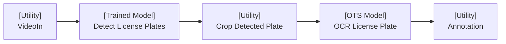

# License Plate Detection Demo

## Table of Contents
- [License Plate Detection Demo](#license-plate-detection-demo)
  - [Overview](#overview)
  - [Running the demo](#running-the-demo)
    - [Requirements](#requirements)
    - [Steps](#steps)

## Overview

This example demonstrates several filter types easily composed together to achieve a simple task: Identify License Plate Numbers in a drive through



This example demonstrates five filters composed together to achieve our **license plate number detection** goal:

* **VideoIn**
  A **Utility** filter (does not run any models) which takes in an RTSP feed or a video file and pushes the frames forward through the pipeline.

* **License Plate Number Detection Filter**
  A **Trained Model** filter which takes in a frame and performs object detection on license plates, then forwards the frame and detection metadata to downstream filters.

* **Crop Detected Plate Filter**
  A **Utility** filter that takes in frames and associated license plate bounding box metadata, crops the regions corresponding to detected plates, and emits the cropped plate images for further analysis.

* **OCR License Plate Filter**
  An **Off-the-Shelf (OTS) Model** filter that processes the cropped plate images and applies optical character recognition (OCR) to extract the license plate number as text.

* **Annotation Filter**
  A **Utility** filter that takes the original frame and overlays bounding boxes and recognized license plate numbers on top of it, producing a visually annotated result suitable for display or archival.
  Notice that this filter has access to the bounding boxes from the license plate detection filter, the cropped image from the crop filter and the OCR result from the OCR filter as all the data is intentionally carried forward.

## Running the demo

### Requirements

- [Python 3.11](https://www.python.org/downloads/release/python-3110/)
- Linux system

> Note: This project is designed with Linux support in mind. It should run on macOS, but your mileage may vary.

### Steps
1. [Optional] Create a virtual environemnt using a tool of your choosing (`venv` is used here)
```
python -m venv venv
source venv/bin/activate
```
2. run `make install`
3. run `make run`
4. visit `http://localhost:8000`

`make run` executes the filter pipeline via the openfilter CLI as follows:

```bash
openfilter run \
	- VideoIn \
		--sources 'file://example_video.mp4!loop' \
	- filter_license_plate_detection.filter.FilterLicensePlateDetection \
	- filter_crop.filter.FilterCrop \
		--detection_key license_plate_detection \
		--detection_class_field label \
		--detection_roi_field box \
		--output_prefix cropped_ \
		--mutate_original_frames false \
		--topic_mode main_only \
	- filter_optical_character_recognition.filter.FilterOpticalCharacterRecognition \
		--topic_pattern 'license_plate' \
		--ocr_engine easyocr \
		--forward_ocr_texts true \
	- filter_license_annotation_demo.filter.FilterLicenseAnnotationDemo \
		--cropped_topic_suffix license_plate \
	- Webvis
```

#### Alternatively, you may use the `Filter.run_multi` utility as follows:
```bash
python filter_license_plate_pipeline_demo/main.py
```

We encourage the inspect the content of [filter_license_plate_pipeline_demo/main.py](filter_license_plate_pipeline_demo/main.py) for a code example!
